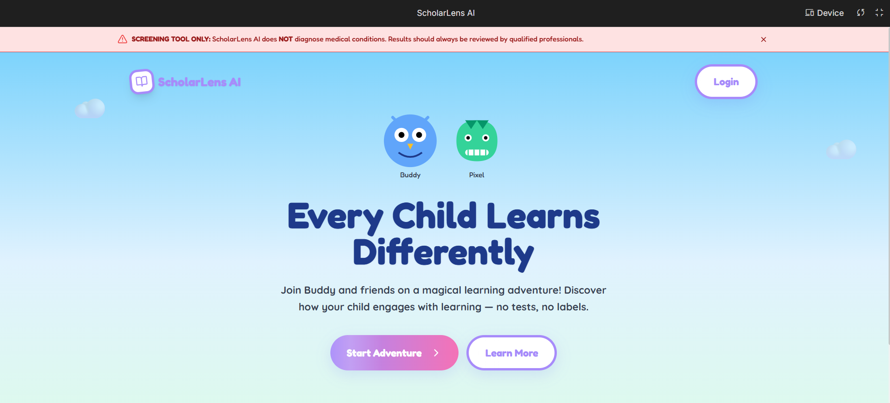

<br/>
<br/>


# 🎓 ScholarLens AI

> **Early Learning Pattern Observation Tool** — Helping parents understand how their children engage with learning activities through AI-powered observations.

[](https://ai.google.dev/)
[](https://kaggle.com/competitions/gemini-3)
[](LICENSE)
[](https://ai.studio/apps/drive/1GYiBMwDrO0ixlw74TZmH5VniViQ9eQna?fullscreenApplet=true)

---

## 🌟 What is ScholarLens AI?

ScholarLens AI is a **child-friendly educational observation platform** that uses Google's Gemini 3 Pro multimodal AI to help parents and educators understand how children engage with learning activities.

> ⚠️ **IMPORTANT**: This is a **screening observation tool**, NOT a diagnostic instrument. It does NOT assess ability, intelligence, or diagnose any conditions. Always consult qualified professionals for evaluations.

### 🎯 Key Features

| Feature | Description |
|---------|-------------|
| 📖 **Reading Observation** | Analyzes reading engagement patterns through video |
| ✍️ **Writing Observation** | Live handwriting analysis with real-time metrics |
| 🧮 **Math Observation** | Observes problem-solving approach and engagement |
| 🎯 **Focus Observation** | Tracks attention patterns during activities |
| 🔒 **Privacy First** | COPPA/GDPR/DPDP Act compliant, on-device processing |
| 🤖 **AI Transparency** | Full explainability of what AI observed and limitations |

---

## 🎮 Demo

**Live App**: [🚀 Try ScholarLens AI Now!](https://ai.studio/apps/drive/1GYiBMwDrO0ixlw74TZmH5VniViQ9eQna?fullscreenApplet=true)

### Screenshots

| Age Gate | Activity Instructions | Explainability Panel |
|----------|----------------------|---------------------|
| Child-safety first | Step-by-step guidance | What AI observed |

---

## 🛡️ AI Safety & Ethics

This app implements **comprehensive AI safety guardrails**:

### Non-Assessment Philosophy
- ❌ Does NOT measure ability, intelligence, or potential
- ❌ Does NOT diagnose learning disabilities
- ❌ Does NOT compare children to "normal" or "average"
- ✅ Observes engagement patterns only
- ✅ Uses strengths-based, growth-oriented language
- ✅ Provides alternative explanations for all observations

### Built-in Guardrails
- **Anti-bias Detection**: Flags labeling language (e.g., "slow learner", "struggling")
- **Audit Logging**: All AI interactions are logged for accountability
- **Explainability**: Users see what AI observed and its limitations
- **Consent Flows**: COPPA-compliant parent/guardian consent
- **Data Rights**: Export and delete all data anytime

---

## 🏗️ Technical Architecture

```
ScholarLensAI/
├── App.tsx                 # Main application with state management
├── constants.ts            # AI system instructions & safety guardrails
├── components/
│   ├── Compliance.tsx      # Consent, age gate, data management
│   ├── LegalDocs.tsx       # Privacy policy, terms of service
│   ├── DisclaimerBanner.tsx # Critical safety disclaimers
│   ├── ExplainabilityPanel.tsx # AI transparency UI
│   ├── MagicalUI.tsx       # Child-friendly UI components
│   ├── LiveHandwritingAnalysis.tsx # Canvas + real-time metrics
│   └── Visualizations.tsx  # Radar charts for engagement patterns
├── services/
│   ├── geminiService.ts    # Gemini 3 Pro API integration
│   ├── aiAudit.ts          # AI monitoring & bias detection
│   └── storage.ts          # Local storage management
└── types.ts                # TypeScript definitions
```

### Gemini 3 Pro Capabilities Used

| Capability | Use Case |
|------------|----------|
| **Video Understanding** | Analyzing reading and attention sessions |
| **Image Analysis** | Handwriting pattern observation |
| **Advanced Reasoning** | Multi-dimensional engagement scoring |
| **Context Window** | Child profile personalization |

---

## 🚀 Run and Deploy Your AI Studio App

> *This section preserved from Google AI Studio*

This contains everything you need to run your app locally.

**View your app in AI Studio**: https://ai.studio/apps/drive/1GYiBMwDrO0ixlw74TZmH5VniViQ9eQna

### Run Locally

**Prerequisites:** Node.js

1. Install dependencies:
   ```bash
   npm install
   ```

2. Set the `GEMINI_API_KEY` in [.env.local](.env.local) to your Gemini API key

3. Run the app:
   ```bash
   npm run dev
   ```

---

## 📋 Compliance & Privacy

| Regulation | Status |
|------------|--------|
| **COPPA** (Children's Online Privacy Protection Act) | ✅ Implemented |
| **GDPR** (General Data Protection Regulation) | ✅ Implemented |
| **DPDP Act** (India Digital Personal Data Protection) | ✅ Implemented |

### Data Handling
- ✅ Videos processed in real-time, not stored
- ✅ Handwriting analyzed locally, strokes not persisted
- ✅ Parent can export all data as JSON
- ✅ Parent can delete all data with one click
- ✅ No data shared with third parties

---

## 🎯 Hackathon Submission

**Competition**: [Google DeepMind - Vibe Code with Gemini 3 Pro](https://kaggle.com/competitions/gemini-3)

**Track**: 🎓 Education - Reimagine Learning

**Impact Statement**: 
> Learning differences affect 1 in 5 children. Early observation can lead to earlier support. ScholarLens AI empowers parents with AI-assisted insights while maintaining strict ethical guardrails to never label or judge children.

---

## � Author & Maintainer

**Vikas Sahani**
*   **GitHub:** [VIKAS9793](https://github.com/VIKAS9793)
*   **LinkedIn:** [Vikas Sahani](https://www.linkedin.com/in/vikas-sahani-727420358)
*   **Email:** vikassahani17@gmail.com
*   **Kaggle:** [vikassahani9793](https://www.kaggle.com/vikassahani9793)
*   **Developer Profile:** [g.dev/vikas9793](https://g.dev/vikas9793)

Built with ❤️ for the Gemini 3 Pro Hackathon

---

## 🤝 Contributing

We welcome contributions! Please read our [Contributing Guidelines](CONTRIBUTING.md) before submitting PRs.

Key requirements:
- Follow our ethical guidelines (no labeling language)
- Ensure child safety and privacy compliance
- Test in AI Studio before submitting

---

## 📄 License

This project is licensed under the MIT License - see the [LICENSE](LICENSE) file for details.

---

<div align="center">

**⚠️ CRITICAL REMINDER ⚠️**

*ScholarLens AI is a screening observation tool ONLY.*
*It does NOT diagnose conditions or assess ability.*
*Always consult qualified healthcare and educational professionals.*

</div>
